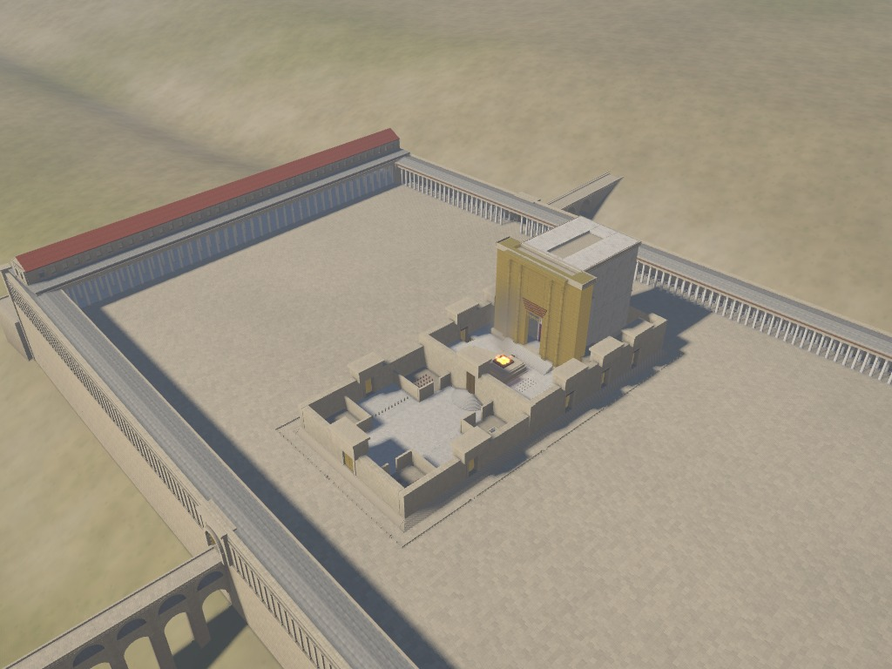
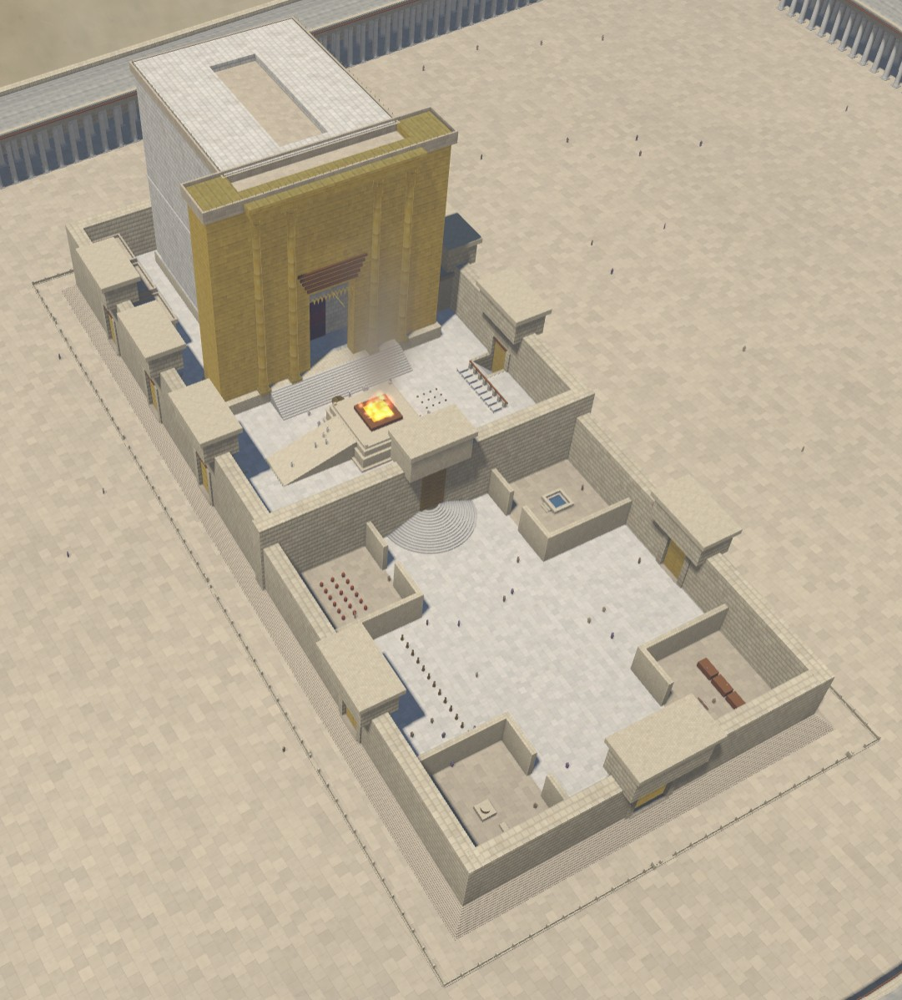
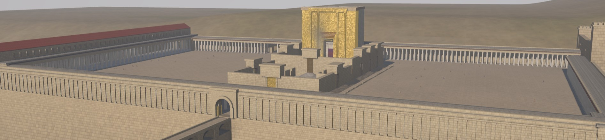
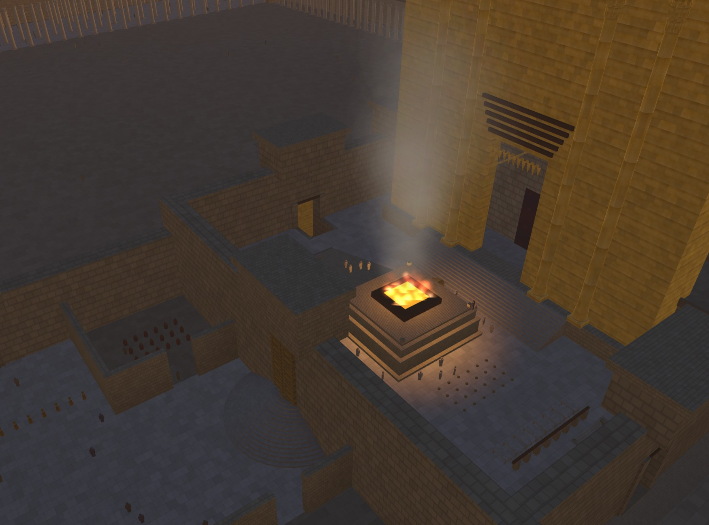

# Herod's Temple Mount

[Live demo](https://www.openbible.info/labs/3d-temple-mount/) · [Blog post](https://www.openbible.info/blog/2026/07/clauding-an-interactive-3d-model-of-herods-temple/)

This README is mostly AI-generated, as is all the code. It's designed mostly for bot consumption rather than human consumption.

This project is an interactive, textured 3D model of the Temple Mount in Jerusalem circa AD 30, the setting of many New Testament events involving Jesus and Paul before its destruction in AD 70. It runs in a browser with no libraries, server, or network connection.



Open `index.html` to run the model. The file is self-contained and can be opened from disk, placed on a static host, or served under a strict content-security policy without modification.

The model's dimensions draw on the Mishnah tractate *Middot*, Josephus, excavation reports, and stated reconstruction choices. Where the sources disagree, as they do on the altar, gate heights, and width of the Sanctuary, the relevant panel identifies the selected source and notes the variant. `node util/verify.js` checks about thirty geometric relationships and exits with a nonzero status if any check fails.

This is a reconstruction, not a survey, and there have been no excavations under the Haram esh-Sharif. Large parts of the model therefore represent an interpretation of texts that were not written as construction documents. The About tab identifies those areas and explains the choices made.

## What it's built from

| Part of the complex | Source followed |
|---|---|
| Inner sacred precinct—courts, levels, altar, Sanctuary | Mishnah, *Middot* 1:1–5:4 |
| Outer colonnades, Royal Stoa, Antonia | Josephus, *War* 5.184–247; *Ant.* 15.380–425 |
| Retaining walls, gates, streets, staircases, ritual baths | Temple Mount excavations: Warren 1867–70, B. Mazar 1968–78, Ben-Dov, Reich & Billig |
| Position and 4.2° skew of the sacred precinct | Ritmeyer's identification of the pre-Herodian 500-cubit square |
| Pilaster order on the retaining walls | Herod's surviving enclosure over the Cave of the Patriarchs, Hebron |
| Causeway to the Mount of Olives | Mishnah, *Parah* 3:6 |
| Four columns on the Sanctuary front | Josephus, plus the Bar Kokhba coins and synagogue reliefs |

The cubit used throughout is the royal cubit of 52.5 cm.

## What's modeled

The platform is four retaining walls in Herodian ashlar with drafted margins and flat bosses, crowned by a pilaster order, enclosing a paved esplanade of about 34.7 acres. Double colonnades of monolithic marble columns twenty-five cubits high line the northern, eastern and western sides; Solomon's Porch occupies the eastern colonnade.

The Royal Stoa occupies the southern side. It is a basilica the length of the wall, with 162 Corinthian columns in four rows, the fourth engaged in the wall itself; two aisles flanking a nave half again as wide; a clerestory pierced in every bay; and a terracotta ridge roof.

There are eight entrances, each based on distinct evidence. The southern staircase is thirty steps with alternating deep and shallow treads, matching the 65.5 m stretch excavated by Mazar, with the ritual baths cut below it. The Double Gate opens from its upper landing. The Triple Gate has a dedicated ramp that descends to the street running east along the wall to the southeast angle. Robinson's Arch comprises the great arch crossing the street to its pier, a stepped street descending from that pier over seven additional arches to the pavement, and a final flight climbing to a gate into the Royal Stoa. The other entrances are Wilson's causeway from the Upper City; Barclay's and Warren's gates in the western wall; the Shushan Gate, an arched and barrel-vaulted gatehouse where the double-arcaded causeway from the Mount of Olives arrives; and the Tadi Gate on the north, which Middot says went unused.

The sacred precinct has the soreg and its warning inscriptions; the chel and its twelve steps, which wrap the courts as concentric rings and arrive level with every threshold; the Court of the Women with four corner chambers, a gallery and thirteen trumpet-shaped chests; the Nicanor Gate and the fifteen semicircular steps; the Court of Israel and the duchan; the Court of the Priests and its chambers; the altar of burnt offering with its ramp; the slaughtering floor with its rings, tables and pillars; and the laver.

The Sanctuary is a hundred cubits in each dimension. A gilded front carries four columns and the golden vine; the porch stands open, with no doors; the Hekhal has gold-plated doors with the Babylonian veil hanging before them. Inside are the menorah, the table of the Presence and the altar of incense, and behind two veils the empty Holy of Holies. Thirty-eight cells in three stories are visible when the building is sectioned.



The surrounding model includes the Antonia on its scarped rock at the northwest, aligned with the Temple's north wall. Josephus places the fortress at the junction of the northern and western porticoes and records passages to both. Ritmeyer interprets surviving beam sockets in the rockscarp as evidence for the northern portico. The reconstruction uses a roof-level connection consistent with those sources; the precise form of the access is not preserved. The surrounding terrain also includes the Struthion Pool and Pool of Israel, the Herodian street and its shops, the Kidron and Tyropoeon valleys, the western hill, and the Mount of Olives at their relative historical elevations. Hillside surfaces vary between soil and bedrock according to slope.

The city's houses are deliberately not shown because the focus is on the Temple Mount, and there is not enough evidence here to reconstruct them with the same confidence as the rest of the model. For experimentation, `SHOW_CITY_BUILDINGS` in `src/50-build-mount.js` enables a hypothetical version of them.



## Results derived from the geometry

These are particularly useful checks because they emerge from the combined geometry rather than from being set directly:

- The Shushan Gate in the eastern wall lies within 0.6 m of the Sanctuary's axis under Ritmeyer's proposed layout.
- Middot 4:6's thirteen courses of height, Middot 4:7's two runs of a hundred cubits, and Middot 5:1's 187 cubits all close exactly.
- Middot 2:1's rank order of the four open margins—largest south, then east, then north, smallest west—is satisfied by where the precinct sits.

`node util/verify.js` runs these and about thirty other checks headlessly, in a `vm` context with `document.createElement` stubbed to throw, so the geometry builder remains independent of the browser.

## Using it

The interface is hidden by default. Press `H` or select the control in the corner to show it; press `H` again to hide it. `?ui=1` starts with the interface visible.

There is one camera and it orbits. Drag to turn, wheel or pinch to zoom, right-drag or two-finger drag to pan. The arrow keys turn too: `←` `→` swing round the subject, `↑` `↓` raise and lower the eye, `Ctrl` with `↑` `↓` moves in and out, `Ctrl` with `←` `→` slides sideways, and `Shift` does all of it faster.

At the minimum orbit radius, further zoom input advances the pivot instead. This allows continuous movement through the model by wheel or pinch, including on devices without a keyboard.

Half the guide's viewpoints place the camera on the pavement at a visitor's eye height rather than above the model. These use the same orbit controls, with the pivot placed along the line of sight toward the subject.

When the interface is visible, `←` and `→` navigate the passage guide instead of rotating the camera.

With the interface visible, select any part of the model to display its dimensions and citations. The four tabs are Passages, which places the New Testament's Temple scenes and labels each by the precision of its textual location (named, narrowed by the architecture, court-level only, or disputed); Plan, which indexes every structure; View, which contains the cutaway, layer toggles and time-of-day control; and About, which describes the evidence and its limits.

On touch devices, drag rotates the camera, pinch zooms, and tapping a model element selects it. Interactive controls use touch-sized targets.

Camera collision is not enforced, allowing structures to be inspected from within their geometry.

| Key | |
|---|---|
| `R` | roofs and ceilings |
| `X` | section the Sanctuary |
| `P` | figures for scale |
| `C` | terrain and valleys |
| `F` | fire and smoke |
| `L` | labels |
| `Q` | the 500-cubit square |
| `G` | cubit grid |
| `H` | show the interface, and hide it again |
| `V` | copy the address of the current view |
| `←` `→` `↑` `↓` | move; passage steps when the interface is up |
| `Ctrl` `↑` `↓` | move in and out |
| `Ctrl` `←` `→` | slide sideways |

## Deep links

The address bar encodes the current view so it can be copied and restored. Updates are debounced until movement stops, producing one history entry per drag or camera flight.

`index.html?view=altar&hour=17.5&section=1`

| Parameter | Values |
|---|---|
| `view` | `aerial` `south` `royal` `court` `altar` `holy` |
| `passage` | `0`–`23`, an entry in the passage guide |
| `go` | any key from the Plan index, e.g. `go=struthion` |
| `tab` | `passages` `plan` `view` `src`—`src` is the About tab |
| `cam` | `ex,ey,ez,tx,ty,tz`—eye and target in world meters |
| `fov` | field of view in degrees |
| `hour` | `5.2`–`18.8`; solar position for 31.778° N in mid-April |
| `t` | pins the animation clock, in seconds, for reproducible screenshots |
| `section` | `1` to cut the Sanctuary open along its axis |
| `square` | `1` to show the pre-Herodian 500-cubit square |
| `grid` | `1` for a cubit grid on the esplanade |
| `roofs` | `0` to lift the roofs off |
| `plain` | `1` to drop the terrain and the figures |
| `ui` | `1` to start with the interface up; `none` to hide the way back to it too |

## How it's drawn

The custom WebGL2 renderer uses no libraries, allowing the page to remain self-contained and compatible with a strict CSP. It uses one merged vertex buffer and 47 draw groups, a directional shadow map that follows the camera focus, hemispheric ambient light with a ground-bounce term, a sky reflection with a Fresnel rise for gold, bronze and water, a calculated solar position for Jerusalem, and a clip plane for the cutaway. Flames and smoke are camera-facing billboards animated entirely in the shader.

Key rendering decisions are summarized below.

### Ambient occlusion is baked, not computed per frame

Because the geometry is static, the model is voxelized once at load and a short hemisphere of rays is cast from every vertex. The result is incorporated into the shader's occlusion term, darkening colonnade interiors, wall bases, and gaps between columns that direct and hemispheric lighting do not describe. The process adds about one second to loading and has no per-frame cost.

### Dirt is that same baked occlusion, read a second time

The dirt term increases where surfaces have limited sky exposure and rain washing, including retaining-wall bases, inside corners, and areas beneath cornices. The Sanctuary and its courts remain clean, consistent with their age and Josephus's description of their highly reflective surfaces.

### The gilding and the bronze are lit as conductors, not as colored paint

Specular highlights take the metal color rather than the light color, diffuse reflection is minimal, and the environment reflection distinguishes ground from sky. Slightly different orientations are assigned to individual sheets of gilding to vary their reflected highlights.



### Stone variation does not repeat

A tiled texture with per-stone tones repeats the same arrangement every few meters, making the pattern visible across a 300 m court or a 280 m wall. Stone tone is therefore hashed from world position, while the textures contain only repeating features such as joints, drafted margins, bevels, and grain.

### Shadows soften with distance from what casts them

A wide five-tap probe classifies each pixel as fully lit, fully shadowed, or within a penumbra. The first two cases use those five samples; penumbra pixels use a twelve-tap disc whose radius follows distance from the casting edge.

### The retaining wall's courses diminish as it rises

From about 2.4 m at the foot to 1.2 m at the top, as Herod's masons laid them.

Every texture is drawn on a 2-D canvas at load: Herodian ashlar with its drafted margins, marble with vertical veining for the monolithic shafts, hammered gold plate, Corinthian bronze, cedar, terracotta pantiles, the woven parochet. The stone textures are differentiated a second time into normal maps, so the drafted margins and the joints catch raking light instead of being painted on.

The model comes to about 302,000 triangles and 35 selectable structures, from roughly 9,600 lines of source concatenated into a single 478 KB page. For exact current figures, run `node util/verify.js`.

## Layout

```
src/01-shell.html      markup and stylesheet
src/10-math.js         mat4 / vec3
src/20-textures.js     every texture, drawn procedurally on a canvas
src/30-geom.js         geometry builder: primitives, transform stack, part
                       registry, and the ambient-occlusion bake
src/40-data.js         the historical record as constants, plus all panel text
src/50-build-mount.js  terrain, walls, esplanade, colonnades, Royal Stoa,
                       Antonia, gates, pools, arches, causeways
src/55-build-temple.js the sacred precinct, the Sanctuary, fire emitters, crowds
src/60-gl.js           WebGL2 renderer: shadow map, sky, section plane, billboards
src/70-app.js          camera, input, picking, interface

img/                   images used by this README

build.sh               concatenate src/ → index.html
util/verify.js         headless geometry and dimension checks
util/probe.js          report geometry intersecting a world-space box
util/capture.sh        create one headless image capture
util/capture-all.sh    create the standard set of image captures
util/png-to-jpeg.py    convert captured PNG files to JPEG
AGENTS.md              technical notes for modifying the model
```

## Building

`./build.sh` concatenates `src/` into `index.html` and runs `node --check` over every JavaScript file, so a syntax error fails the build instead of shipping. There is no bundler or package dependency. Building and verification require Bash and Node, but do not require WSL or a browser.

The optional image-capture utilities are currently WSL-specific. They run Windows Edge with SwiftShader and use Python with Pillow for JPEG conversion; they are not part of the build or verification process.

Because `index.html` is generated, make changes in `src/` and then run the build.

To change a dimension, update it in `40-data.js`. The geometry and the camera positions are both derived from it, so a corrected cubit moves the walls and the viewpoints together. Then run `node util/verify.js`, which reports if the change breaks one of the checked relationships in Middot.

`AGENTS.md` documents the two coordinate frames, the layer system, and approximately ninety implementation invariants required to maintain consistent geometry.

## License

All the code in this project was written by an LLM. Under current US Copyright Office guidance, material generated by a model without sufficient human authorship may not be eligible for copyright. The project's research, source selection, design decisions and revisions may nevertheless include copyrightable human contributions.

The repository includes the [MIT License](LICENSE.md), which applies to any copyrightable material covered by the repository's copyright notice. Material that is not eligible for copyright does not require a copyright license.

Please feel free to use it and modify it as you like.
